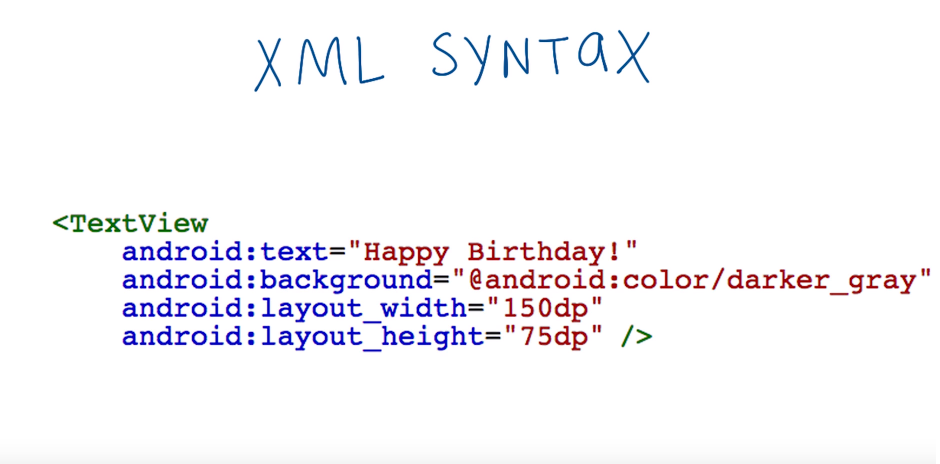

# Exp3ViewAttributes



Here are the words we introduced in this above image:
```
XML element
Tag
Self-closing tags
Attributes
Syntax
```

Important Links
---------------

Android Layout Visualizer
[Experiment with Android Layout XML][1] with this visualizer.

Learn about text appearance from [Material Design typography guidelines][2]

[Material Design color palette][3] and HTML Color Values from [W3School][4]

[1]: https://labs.udacity.com/android-visualizer/
[2]: https://material.io/design/typography/#applying-the-type-scale
[3]: https://material.io/design/color/#color-color-palette
[4]: https://www.w3schools.com/colors/colors_hex.asp
